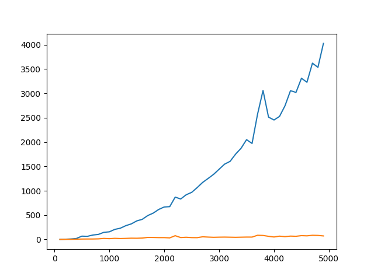

# Sort Comparison

This program implements Merge Sort and Selection Sort algorithms and compares their performances. It generates random integer arrays of various sizes and measures the execution time of each algorithm. The results are plotted on a graph to visualize the performance difference between the two sorting algorithms.

## Prerequisites

* Python 3.x
* matplotlib library

## Installation

1. Clone or download the repository.
2. Install the matplotlib library: `pip install matplotlib`

## Usage

1. Open a terminal and navigate to the program directory.
2. Run the program: `main.py`
3. The program generates arrays of various sizes and measures the execution time for each algorithm.
4. The program outputs a graph of the execution times for each sorting algorithm.

## Sample Graph

